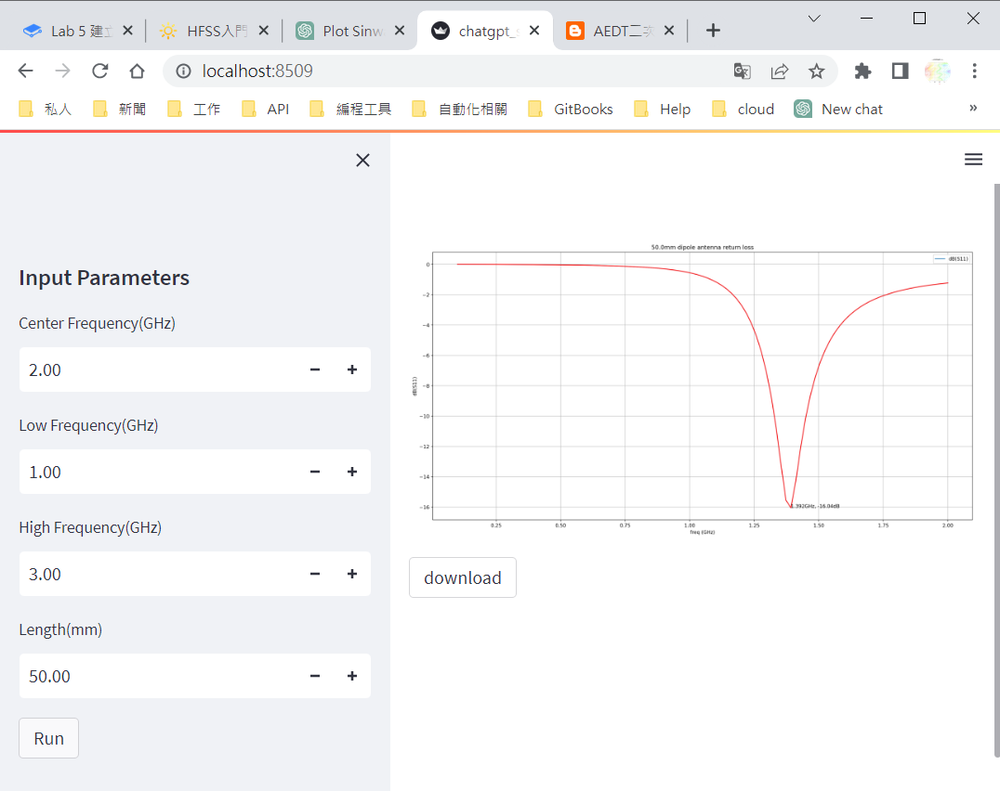

# Python及PyAEDT套件安裝

Ansys Python Manager是一款免費的開源工具，可以用來無縫安裝Python、PyAnsys套件和常用Python庫。它還有助於創建和管理Python虛擬環境。此工具旨在最大限度地減少新PyAnsys用戶和Ansys客戶的安裝問題。 只要聯網狀況底下，不需要再透過下指令的方式(pip install xxx)，可以在Ansys Python Manager當中快速安裝Python、Python常用套件及PyANSYS底下的模組。

<figure><figcaption></figcaption></figure>


